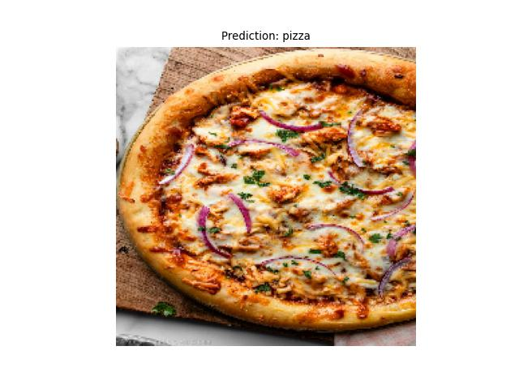
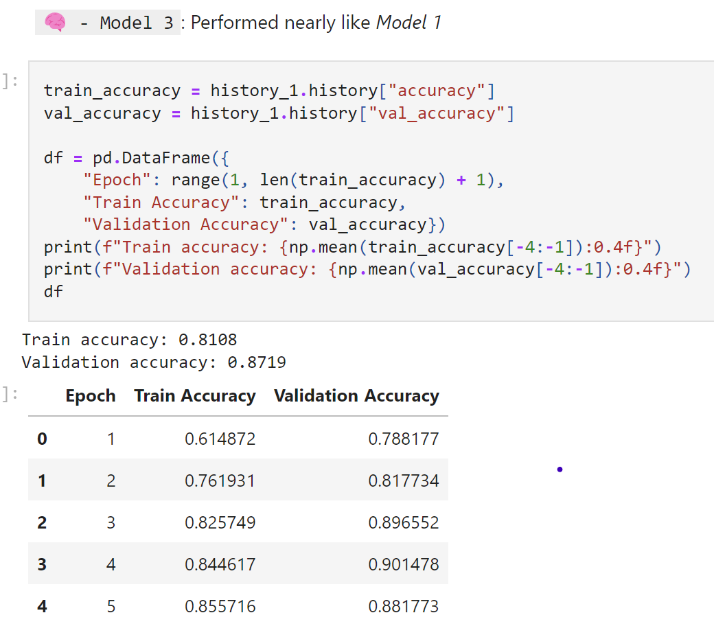
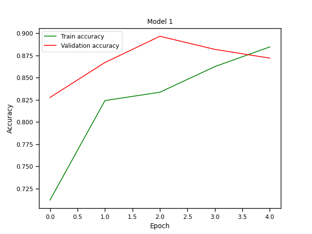
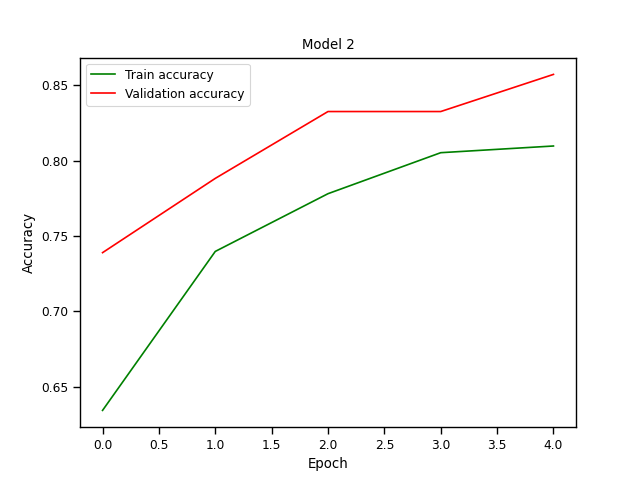
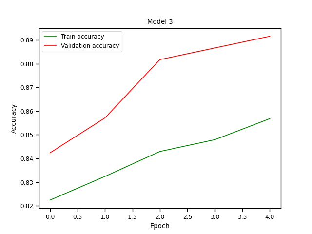
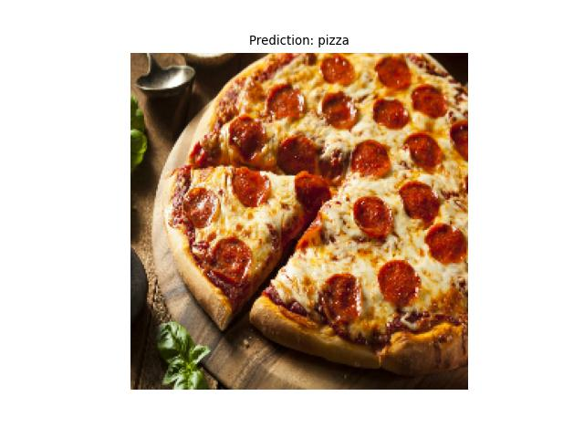
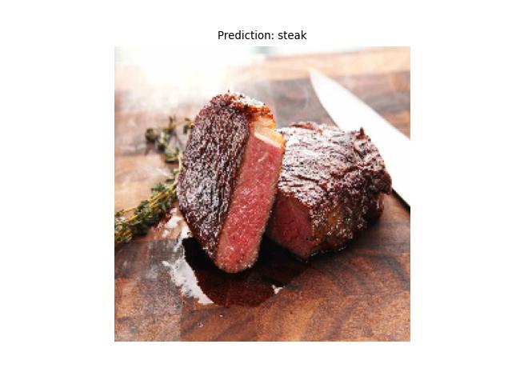

# Food Image classification using CNN

This project aims to develop a Convolutional Neural Network (CNN) model to classify images of food into various categories. The model is trained on a dataset of food images and will be able to accurately identify different types of food from new, unseen images. For this stage of project, It just classifies two catagory of food, Steak & Pizza 🥩🍕



## Table of Contents

- [Architecture](#Architecture)
- [Code](#Code)
- [Screenshots](#screenshots)
- [Installation](#installation)
- [Usage](#usage)

## Architecture

The term `Tiny VGG` refers to a simplified or reduced version of the VGG (Visual Geometry Group) architecture, which is a type of Convolutional Neural Network (CNN). The original VGG networks, such as VGG16 and VGG19, are known for their deep architecture with a large number of layers, specifically 16 and 19 layers, respectively. However, these models are computationally expensive and may be overkill for smaller tasks or datasets.

Because of the lack of computational resources, I used `Tiny VGG` instead of common VGGs.


## Code

The code is written in **python** language in **Jupiter notebook** & **Google Colab**.
I used numpy and matplotlib to visualize and preprocess data, On the top of that tensorflow helped me with building my CNN model.

You can access the notebook via `Notebook.ipynb` in my github **(https://github.com/Matin-Rasoulzad/Food-Image-classification-using-CNN/blob/main/Notebook.ipynb)**



## Screenshots

Here are some screenshots of the project:

### Model accuracy

This CNN project has been trained in 3 different `Tiny VGG` models but with different learning rates




### Predictions

The predictions of the `Final Model`.

<br>

As you see it can confidentially classify `steak🥩` & `pizza🍕`.

<br>

In later versions we try to add new food catagories from `Food 101 dataset`**(https://www.kaggle.com/datasets/dansbecker/food-101)**

## Installation

Instructions on how to install and run the project locally.

```bash
# Clone the repository
git clone https://github.com/Matin-Rasoulzad/Food-Image-classification-using-CNN.git

# Navigate to the project directory
cd Food-Image-classification-using-CNN

# Install dependencies
pip install tensorflow numpy matplotlib seaborn pandas
```
